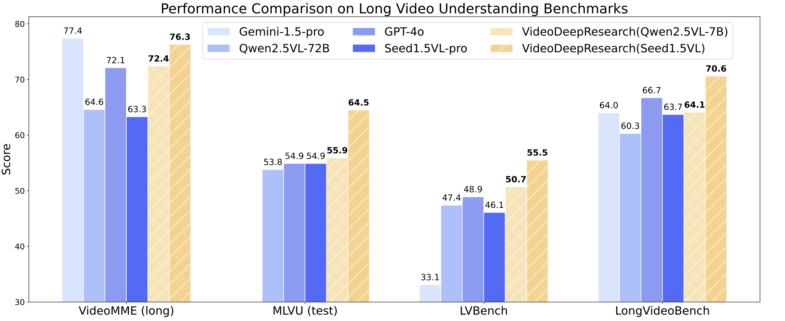

# 🎬 VideoDeepResearch: Long Video Understanding with Agentic Tool Using

<p align="center">
    <a href="https://arxiv.org/abs/2504.21776">
            
    </a>
    <a href="https://github.com/Aqauticray/VideoDeepResearch/releases" style="display: inline-block; padding: 10px; background-color: #4CAF50; color: white; text-align: center; border-radius: 5px; text-decoration: none;">Check Releases</a>
</p>

## 👉 Introduction

VideoDeepResearch is an innovative framework designed to enhance long video understanding (LVU). It employs a text-only reasoning model integrated with modular multimodal tools. This approach outperforms existing MLLM baselines across major LVU benchmarks. The goal is to provide a comprehensive understanding of long videos, making it easier for users to extract meaningful insights from extensive visual content.

<p align="center">
  
</p>

## 🎬 Demo

<div align="center">
    <video controls src="https://github.com/user-attachments/assets/6f90154b-1ab4-4df3-ac02-1deb26d702f1" width="80%"/>
</div>

## ✨ Key Features

* 📹 **Diverse Long-Video Understanding**
  * Supports single-detail, multi-detail, and multi-hop question answering across various scenes.
  
* 🛠️ **Multi-Tool Integration**
  * Includes tools such as Visual Perceiver, Video Browser, and Text/Subtitle/Image Retriever & Extractor. This integration allows users to engage with video content more effectively.

* 🔄 **Dynamic Interaction**
  * Enables users to interact with videos in real-time, making the analysis process more intuitive.

## 📚 Installation

To get started with VideoDeepResearch, follow these steps:

1. **Clone the Repository**

   Open your terminal and run:

   ```bash
   git clone https://github.com/Aqauticray/VideoDeepResearch.git
   ```

2. **Navigate to the Directory**

   Change into the project directory:

   ```bash
   cd VideoDeepResearch
   ```

3. **Install Dependencies**

   Make sure you have Python installed. Then, run:

   ```bash
   pip install -r requirements.txt
   ```

4. **Run the Application**

   You can now run the application with:

   ```bash
   python main.py
   ```

## 📖 Usage

### Basic Workflow

1. **Load a Video**

   Load your desired video file into the application. The framework supports various video formats.

2. **Select Tools**

   Choose from the available tools to analyze the video. You can switch between tools as needed.

3. **Ask Questions**

   Utilize the question-answering feature to gain insights. You can ask single-detail or multi-detail questions based on the content.

4. **View Results**

   Results will display on the screen, providing a clear understanding of the video's content.

### Example Queries

- What happens in the first scene?
- How many characters appear throughout the video?
- Describe the main events in the second half.

## 🛠️ Tools Overview

### Visual Perceiver

The Visual Perceiver analyzes the visual elements of the video, identifying objects, actions, and interactions.

### Video Browser

The Video Browser allows users to navigate through the video easily. You can jump to specific scenes or sections based on your queries.

### Text/Subtitle/Image Retriever & Extractor

This tool extracts relevant text, subtitles, and images from the video, providing additional context for analysis.

## 🌐 Contributions

We welcome contributions from the community. If you want to contribute, please follow these steps:

1. **Fork the Repository**

   Click on the "Fork" button at the top right corner of the repository page.

2. **Create a New Branch**

   Create a new branch for your feature or fix:

   ```bash
   git checkout -b feature/YourFeatureName
   ```

3. **Make Your Changes**

   Implement your changes and ensure they are well-tested.

4. **Commit Your Changes**

   Commit your changes with a clear message:

   ```bash
   git commit -m "Add your message here"
   ```

5. **Push to Your Fork**

   Push your changes to your forked repository:

   ```bash
   git push origin feature/YourFeatureName
   ```

6. **Open a Pull Request**

   Navigate to the original repository and open a pull request. Provide a clear description of your changes.

## 🔍 Research and References

This project builds upon existing research in the field of long video understanding. For a deeper dive, check out the following papers:

- [Long Video Understanding: A Survey](https://arxiv.org/abs/2504.21776)
- [Multimodal Learning in Video Analysis](https://arxiv.org/abs/2406.04264)

## 📄 License

This project is licensed under the MIT License. See the [LICENSE](LICENSE) file for details.

## 📦 Releases

To access the latest versions of VideoDeepResearch, visit the [Releases](https://github.com/Aqauticray/VideoDeepResearch/releases) section. You can download and execute the latest files for your needs.

## 🤝 Acknowledgments

We acknowledge the contributions of researchers and developers in the field of video understanding. Your work inspires us to innovate and improve.

## 📬 Contact

For questions or feedback, feel free to reach out via the issues section of the repository or contact the maintainers directly.

---

By following this guide, you should be able to set up and use VideoDeepResearch effectively. Enjoy exploring long video content with ease!